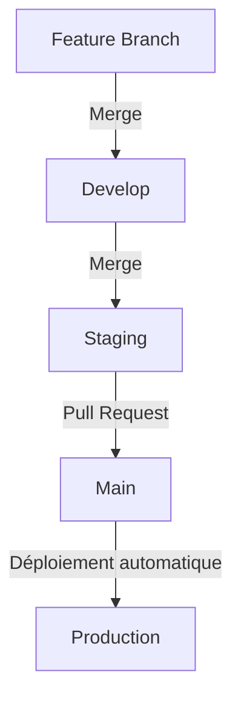

# Snowledge – Plateforme de Social Learning

## 🎯 Aperçu du Projet

**Snowledge** est une plateforme de social learning qui vise à réinventer l’apprentissage collaboratif à l’ère du Web3, tout en garantissant une **expérience fluide de type Web2**. Elle permet aux utilisateurs de créer, rejoindre et animer des communautés éducatives, tout en s’appuyant sur la **blockchain Starknet** pour gérer une identité numérique via des **Soulbound Tokens (SBTs)**.

> **Objectif :** Apporter les bénéfices du Web3 (traçabilité, transparence, ownership) sans imposer de barrières techniques.

---

## 🚀 Fonctionnalités Clés

### 👥 Comptes & Identité Blockchain

- Création de compte = Mint automatique d’un **SBT** sur Starknet.
- Le SBT sert d’identité décentralisée et historise :
  - Les communautés rejointes et créées
  - (À venir) Les contributions, la réputation, etc.
- Aucun portefeuille requis : **expérience utilisateur 100 % Web2**.

### 📚 Communautés d’Apprentissage

- Création ou adhésion gratuite à des communautés.
- Chaque communauté comprend :
  - Un **chat temps réel** (multi-canaux)
  - Une **FAQ communautaire**
  - Un onglet de **contenus éducatifs**
  - Un espace pour **propositions & contributions**
  - _(À venir : cours & masterclass)_

### 🧑‍🏫 Outils pour Créateurs

- Édition de posts éducatifs via un éditeur riche (**BlockNoyr**).
- Catégorisation, modification post-publication, sauvegarde en brouillon.
- Dashboard de gestion :
  - Modération des membres
  - Suivi des contenus et candidatures

### 🧑‍🤝‍🧑 Parcours Contributeur

- Tout utilisateur peut postuler comme contributeur.
- Une fois accepté :
  - Il peut proposer des contenus
  - Chaque post est soumis à un vote (> 50 % = publication)

### 🔁 Collaboration & Évolution du Contenu

- Possibilité de :
  - Créer un post original
  - Reprendre ou modifier un post existant
- Modifications soumises au **vote communautaire**

### 🧠 Système de Propositions

- Propositions de sujets ouvertes à tous les membres
- Votes communautaires pour valider les sujets intéressants
- Base de réflexion pour de futurs contenus

### 🧾 Structure d’une Communauté

- **Général** : Chat & FAQ
- **Contenus** : Posts validés
- **Contributions** : Brouillons, propositions, suggestions
- _(À venir : cours, masterclass)_

### 🔔 Notifications

- Nouveaux contenus publiés
- Votes, validations ou rejets
- Changement de rôle ou exclusion
- Nouvelles propositions ou modifications

---

## ⚙️ Workflow CI/CD et gestion des branches

Ce document décrit le processus de développement, d’intégration continue et de déploiement continu de l’application.

### Structure des branches

| Branche        | Environnement  | Description                                            |
|----------------|----------------|--------------------------------------------------------|
| `feature/*`    | Local          | Développement de fonctionnalités individuelles         |
| `develop`      | Local          | Intégration des fonctionnalités                        |
| `staging`      | Preview        | Pré-production pour les tests                          |
| `main`         | Production     | Application en production                              |

### Flux de travail standard



1. **Développement de fonctionnalités**
   - Créez une branche à partir de `develop` : `git checkout -b feature/nom-fonctionnalité`
   - Développez et testez localement
   - Pushez régulièrement : `git push origin feature/nom-fonctionnalité`

2. **Intégration**
   - Merge vers `develop` une fois terminé :
     ```bash
     git checkout develop
     git pull
     git merge feature/nom-fonctionnalité
     git push origin develop
     ```

3. **Préparation au déploiement**
   - Merge de `develop` vers `staging` :
     ```bash
     git checkout staging
     git pull
     git merge develop
     git push origin staging
     ```

4. **Mise en production**
   - Pull request de `staging` vers `main`
   - Déclenche le déploiement automatique en production

### Développement en parallèle

- Chaque développeur utilise une branche `feature/*`
- Intégration fréquente dans `develop`
- `staging` centralise les fonctionnalités prêtes à tester
- Une seule PR de `staging` vers `main`

---

## 🛠️ Gestion de la base de données avec Prisma

### Environnements de base de données

| Environnement  | Branche Neon    | Utilisation                            |
|----------------|-----------------|----------------------------------------|
| Local          | `dev`             | Développement individuel               |
| Preview        | `preview`       | Tests d'intégration (CI/CD)            |
| Production     | `main`          | Données de production                  |

### Développement local

1. Configurer `.env.local` avec l’URL locale
2. Modifier `prisma/schema.prisma`
3. Créer une migration :
   ```bash
   npx prisma migrate dev --name nom-de-la-migration
   ```
4. Appliquer localement avec `npx prisma migrate dev`

---

## 🚀 Pipeline CI/CD (GitHub Actions)

Workflow défini dans `.github/workflows/deploy.yml`.

### Déclencheurs

- Push sur `staging*` ou `main`

### Étapes du pipeline

1. **Checkout du code**
2. **Installation Node.js v18**
3. **Installation des dépendances (`npm ci`)**
4. **Génération du client Prisma**
5. **Déploiement des migrations**
6. **Déploiement Vercel** :
   - `staging*` → Preview
   - `main` → Production

### Variables d’environnement

- `PREVIEW_DATABASE_URL`
- `PRODUCTION_DATABASE_URL`
- `VERCEL_TOKEN`, `VERCEL_ORG_ID`, `VERCEL_PROJECT_ID`

---

## ✅ Bonnes pratiques

- Commits atomiques et descriptifs
- PR bien documentées, avec captures si nécessaire
- Migrations testées localement avant push
- Résolution de conflits en priorité sur `develop`
- Tests systématiques en local et en preview avant merge sur `main`

---
