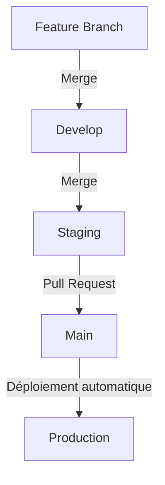

# Workflow CI/CD et gestion des branches

Ce document décrit le processus de développement, d'intégration continue et de déploiement continu de notre application.

## Structure des branches

Notre workflow utilise une structure de branches à plusieurs niveaux pour faciliter le développement collaboratif et les déploiements contrôlés.

| Branche        | Environnement  | Description                                            |
|----------------|----------------|--------------------------------------------------------|
| `feature/*`    | Local          | Développement de fonctionnalités individuelles         |
| `develop`      | Local          | Intégration des fonctionnalités                        |
| `staging`      | Preview        | Pré-production pour les tests                          |
| `main`         | Production     | Application en production                              |

## Flux de travail standard



1. **Développement de fonctionnalités**
   - Créez une branche à partir de `develop` : `git checkout -b feature/nom-fonctionnalité`
   - Développez et testez localement
   - Pushez régulièrement : `git push origin feature/nom-fonctionnalité`

2. **Intégration**
   - Une fois la fonctionnalité terminée, mergez vers `develop` :
     ```bash
     git checkout develop
     git pull
     git merge feature/nom-fonctionnalité
     git push origin develop
     ```
   - Résolvez les conflits potentiels à cette étape

3. **Préparation au déploiement**
   - Mergez `develop` vers `staging` quand vous êtes prêt à tester en pré-production :
     ```bash
     git checkout staging
     git pull
     git merge develop
     git push origin staging
     ```
   - Ceci déclenche automatiquement un déploiement vers l'environnement de prévisualisation

4. **Mise en production**
   - Créez une Pull Request de `staging` vers `main`
   - Après approbation et merge, l'application est automatiquement déployée en production

## Développement en parallèle

Plusieurs développeurs peuvent travailler simultanément sur des fonctionnalités différentes :

- Chaque développeur travaille sur sa propre branche `feature/*`
- Intégration régulière dans `develop` pour résoudre les conflits tôt
- Le merge vers `staging` rassemble toutes les fonctionnalités prêtes pour le test
- Une seule Pull Request de `staging` vers `main` peut contenir plusieurs fonctionnalités

## Gestion de la base de données avec Prisma

### Environnements de base de données

Nous utilisons Neon.tech pour nos instances PostgreSQL, avec 3 environnements distincts :

| Environnement  | Branche Neon    | Utilisation                            |
|----------------|-----------------|----------------------------------------|
| Local          | N/A             | Développement individuel               |
| Preview        | `preview`       | Tests d'intégration (CI/CD)            |
| Production     | `main`          | Données de production                  |

### Développement local avec Prisma

1. **Configuration locale**
   - Chaque développeur travaille avec sa propre base de données locale
   - Utilisez le fichier `.env.local` pour configurer votre connexion locale

2. **Création de migrations**
   - Modifiez votre schéma dans `prisma/schema.prisma`
   - Générez une migration avec un nom descriptif :
     ```bash
     npx prisma migrate dev --name nom-de-la-migration
     ```
   - Vérifiez et commitez les fichiers de migration

3. **Application des migrations**
   - En local : `npx prisma migrate dev`
   - Pour les environnements Preview et Production, les migrations sont appliquées automatiquement lors du déploiement

## Pipeline CI/CD

Notre pipeline d'intégration et de déploiement continu est configuré dans `.github/workflows/deploy.yml` :

### Déclencheurs

Le workflow se déclenche automatiquement lors de :
- Push sur toute branche commençant par `staging` (y compris `staging-*`)
- Push sur `main`

### Étapes du pipeline

1. **Checkout du code**
   - Récupération du code de la branche concernée

2. **Configuration de Node.js**
   - Installation de Node.js v18

3. **Installation des dépendances**
   - Exécution de `npm ci` pour installer les packages

4. **Génération du client Prisma**
   - Exécution de `npx prisma generate`

5. **Déploiement des migrations**
   - Pour les branches `staging*` : déploiement sur la base de données Preview
   - Pour la branche `main` : déploiement sur la base de données Production

6. **Déploiement Vercel**
   - Pour les branches `staging*` : déploiement en prévisualisation
   - Pour la branche `main` : déploiement en production

### Variables d'environnement

Le workflow utilise plusieurs secrets configurés dans GitHub :
- `PREVIEW_DATABASE_URL` : URL de connexion à la base de données de prévisualisation
- `PRODUCTION_DATABASE_URL` : URL de connexion à la base de données de production
- `VERCEL_TOKEN`, `VERCEL_ORG_ID`, `VERCEL_PROJECT_ID` : Informations d'authentification pour Vercel

## Bonnes pratiques

1. **Commits atomiques**
   - Faites des commits petits et fréquents
   - Utilisez des messages de commit descriptifs

2. **Pull Requests**
   - Fournissez des descriptions claires du travail effectué
   - Incluez des captures d'écran si pertinent

3. **Migrations de base de données**
   - Donnez des noms descriptifs aux migrations
   - Testez localement avant de pousser
   - Évitez les changements destructifs non nécessaires

4. **Résolution de conflits**
   - Résolvez les conflits au niveau de `develop` plutôt que `staging`
   - Communiquez avec l'équipe en cas de conflits majeurs

5. **Tests**
   - Testez votre code en local avant d'intégrer
   - Vérifiez le bon fonctionnement dans l'environnement de prévisualisation avant d'approuver la PR vers `main`
