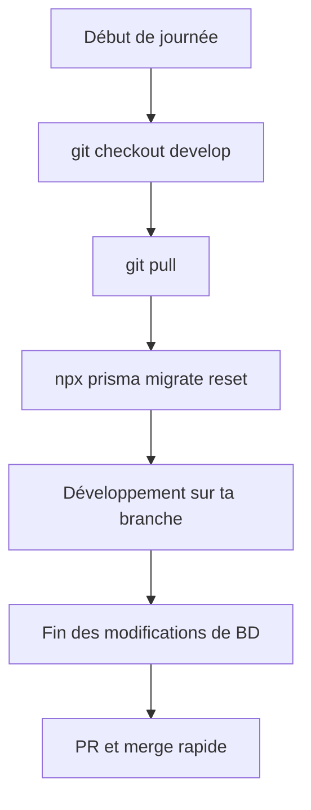

# Gestion des branches et migrations de base de données (Approche simple)

## Problématique

Lorsqu'on travaille avec plusieurs branches Git et une base de données partagée (comme sur Neon), on peut rencontrer des problèmes de compatibilité entre les migrations.

## Risques spécifiques

1. **Conflits de migrations** : Si deux branches créent des migrations avec le même nom/numéro
2. **Incohérences de schéma** : Si une branche supprime un champ et une autre tente d'y accéder
3. **Corruption de données** : Des migrations partielles peuvent laisser la BD dans un état incohérent

## Solution simple recommandée

Pour éviter ces problèmes, nous recommandons l'approche suivante :

### 1. Limiter les branches actives modifiant la base de données

- **Une seule branche de feature à la fois** devrait modifier le schéma de la BD
- Terminer et merger les PRs concernant la BD rapidement
- Communiquer clairement avec l'équipe avant de commencer des modifications de schéma

### 2. Processus sécurisé pour les migrations



### 3. Communication d'équipe

- Annoncer dans Slack/Discord avant de commencer des modifications de schéma
- Indiquer quand les modifications sont terminées et mergées
- Coordonner les migrations complexes

### 4. Bonnes pratiques

- Faire des migrations petites et fréquentes plutôt qu'une grosse migration
- Documenter les changements de schéma pour l'équipe
- Toujours tester les migrations en local avant de les pousser

## Workflow exemple

```bash
# Au début de la journée
git checkout develop
git pull
npx prisma migrate reset  # Pour avoir la dernière version du schéma

# Créer une branche pour ta feature
git checkout -b feature/ajouter-champ-user

# Développement + migration
npx prisma migrate dev --name add_user_field

# Finir et merger rapidement
git push
# Créer la PR et merger dès que possible
# Informer l'équipe que la migration est disponible
```

## En cas de problème

Si vous rencontrez des erreurs lors des migrations :

1. **Erreur de conflits** : Coordonnez avec l'autre développeur pour résoudre le conflit
2. **Erreur de schéma** : Récupérez la dernière version de `develop` et réappliquez vos changements
3. **Erreur de version** : Utilisez `npx prisma migrate reset` pour repartir d'un état propre

Cette approche simple suffit pour les petites équipes et évite d'avoir à configurer des systèmes complexes de branchement BD.
